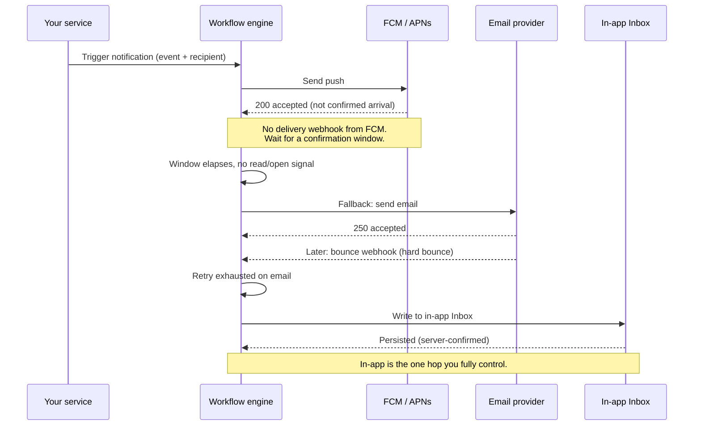

A vendor tells you their notification platform offers "guaranteed delivery." You put it in your architecture diagram. Six months later a customer swears they never got the password reset email, your logs say "delivered," and you spend an afternoon learning that "delivered" in your dashboard meant "we handed it to an SMTP server that returned a 250." Those are not the same event. They are not even close.

This is not a knock on any one vendor. It is a property of the system. The moment a notification leaves your infrastructure, it enters a chain of parties you do not control: an email provider, a mailbox provider, a mobile push gateway, a carrier's SMS network, a device that may be off. Each hop can drop the message, and most of them will never tell you they did. A delivery guarantee that spans that chain cannot exist, because you cannot guarantee behavior you cannot observe.

What you can do is understand exactly what each provider confirms, build retries and fallbacks around the gaps, and instrument the whole thing so that when someone says "I never got it," you have real evidence instead of a green checkmark that means less than it looks like. That is the honest version of the job, and it is the one worth doing well.

## "Delivered" is a lie most dashboards let you believe

Walk through what actually happens when you send a transactional email. Your service connects to an SMTP relay and hands off the message. The relay accepts it and returns a `250 OK`. Your notification tool records this as a success and, in a lot of dashboards, shows it as "delivered."

Here is the problem: `250` means "I have accepted responsibility for this message." It does not mean the recipient's mailbox provider accepted it, and it certainly does not mean a human saw it. Between that `250` and the inbox, the message can still be bounced, greylisted, routed to spam, or silently dropped by a filter that decided your domain looked risky today.

The same optimistic labeling happens across channels. A push gateway returns a `200`, and the dashboard says "delivered." An SMS aggregator queues your message, and the dashboard says "delivered." In almost every case, the word "delivered" is standing in for "accepted by the next hop," which is a much weaker claim. The gap between those two meanings is where your 3am pages live.

The takeaway for anyone designing this: treat the provider's success response as "accepted for processing," not "arrived." Then decide, per channel, how much closer to "arrived" you can actually get.

## What each provider actually confirms

Different channels give you wildly different amounts of downstream signal. Knowing the exact shape of each one tells you where you are flying blind.

### Email: accepted, then maybe delivered, then maybe bounced

SMTP is a store-and-forward protocol, so confirmation arrives in stages, and the stages are not simultaneous.

- **Accepted.** The receiving SMTP server returns `250`. This is synchronous and immediate. It tells you the message was accepted for relay, nothing more.
- **Delivered.** Some email providers (through their APIs and webhooks) report a separate "delivered" event when the destination mailbox provider accepts the message. This is closer to truth, but "the mailbox provider accepted it" still is not "it landed in the inbox rather than spam."
- **Bounced.** A hard bounce (`550`, mailbox does not exist) or soft bounce (`452`, mailbox full) can come back synchronously or asynchronously, sometimes minutes later as a separate bounce message. You have to consume bounce webhooks to catch the async ones.
- **Deferred.** The receiver asks you to try again later (greylisting is common). Not a failure yet, but not delivered either.

So even for email, which has some of the richest downstream signal of any channel, "delivered" is a probabilistic statement, and spam placement is invisible to you entirely.

### Push on iOS: APNs gives you a real answer, eventually

Apple Push Notification service (APNs) returns a meaningful synchronous status when you submit a notification. A `200` means APNs accepted it for delivery to the device. Error statuses are specific and useful: `400` for a bad request, `403` for a certificate or token problem, `410` for a token that is no longer active (the device uninstalled or the token expired). That `410` is genuinely valuable because it lets you prune dead tokens.

APNs also offers store-and-forward with a `apns-expiration` header, and it will collapse notifications with a matching `apns-collapse-id`. What APNs does not hand you by default is a "the user's phone displayed this" event. Its acknowledgment is "I, APNs, have accepted responsibility." It is a stronger acceptance than most, and paired with the companion piece on push tracking it is about as good as this category gets, but it is still acceptance, not proof of arrival on the device.

### Push on Android: FCM accepts, and then goes quiet

Firebase Cloud Messaging (FCM) is the hardest case, and it is worth being precise about why. When you send through the FCM HTTP v1 API, a `200` response with a message name means FCM accepted the message. FCM does not provide delivery receipts or delivery webhooks. There is no callback that fires when the message reaches the device. The FCM documentation is candid that delivery is best-effort and that message success at the API level does not indicate the device received or displayed anything.

You can get some aggregate, delayed insight through the BigQuery data export for FCM, which reports counts of messages sent and, for some message types, delivered. That is an analytics-grade signal with latency, not a per-message, real-time confirmation you can act on in a workflow. For an individual notification, FCM returning success tells you FCM has the message. Whether the phone ever got it is, from your server's point of view, unknowable in real time.

That is not a bug you can engineer around inside FCM. It is a documented limit of the platform, and any vendor claiming per-message Android delivery confirmation through FCM is describing something FCM does not expose.

### SMS: delivery receipts exist, and they vary

SMS is interesting because the protocol does support a delivery receipt (DLR). When you send through an aggregator (Twilio and similar providers), the carrier can return a status callback: `queued`, `sent`, `delivered`, `undelivered`, `failed`. A `delivered` DLR is a real downstream confirmation from the carrier.

The catch is that DLR quality is uneven. Some carriers and some international routes do not return honest receipts, and a few return `delivered` optimistically. So SMS gives you more truth than FCM but less than you would like, and how much you can trust it depends on the route. Consume the status callbacks, but do not treat every `delivered` as gospel on every route.

## At-least-once versus exactly-once

Once you accept that confirmation is partial, the next design question is what delivery semantics you even want.

**Exactly-once delivery is not a thing you can promise across this chain.** It is hard enough inside a single distributed system, and here the last hop is a mobile carrier or a mailbox provider that will happily deliver a message twice if a retry races an ack. Chasing exactly-once at the channel level is chasing a guarantee the substrate cannot give.

**At-least-once is the honest and achievable target.** You retry until you get an acceptance (or exhaust your policy), which means a recipient can occasionally receive a duplicate. The engineering job then splits in two:

1. Make sure every notification is attempted at least once, with retries that survive transient failures.
2. Make duplicates harmless, so that at-least-once does not become annoying-many-times.

That second point is why idempotency matters, and it is the part teams skip.

## Retries, backoff, and idempotency keys

Retries are where good intentions turn into incidents. A retry loop with no backoff turns a provider's brief hiccup into a self-inflicted flood. A retry loop with no idempotency key turns "at-least-once" into "the customer got charged-confirmation emails four times."

Two rules cover most of it. Retry only on errors that can plausibly succeed later (network timeouts, `429` rate limits, `5xx`), and never on errors that will fail identically forever (a `400` bad payload, a `410` dead token). Back off exponentially with jitter so your retries spread out instead of synchronizing into a thundering herd.

```ts
type SendResult = { ok: true } | { ok: false; retryable: boolean };

async function deliverWithRetries(
  notificationId: string,
  send: (idempotencyKey: string) => Promise<SendResult>,
  maxAttempts = 5,
): Promise<boolean> {
  // Same key on every attempt for this notification, so a provider that
  // supports idempotency collapses duplicates from our retries.
  const idempotencyKey = `notif:${notificationId}`;

  for (let attempt = 0; attempt < maxAttempts; attempt++) {
    const result = await send(idempotencyKey);
    if (result.ok) return true;
    if (!result.retryable) return false; // 400, 410: retrying cannot help

    // Exponential backoff with full jitter: base 500ms, cap 30s.
    const backoff = Math.min(30_000, 500 * 2 ** attempt);
    const jittered = Math.random() * backoff;
    await new Promise((r) => setTimeout(r, jittered));
  }
  return false; // exhausted: escalate to fallback, do not silently drop
}
```

The idempotency key is the quiet hero here. If your provider honors idempotency keys (many email and payment-adjacent APIs do), the same key across retries lets the provider deduplicate on its side. Where the provider does not support keys, you carry the burden yourself: record which notification IDs have been accepted, and check before re-sending. Either way, the key has to be stable for a given logical notification, not regenerated per attempt, or it does nothing.

One more thing the loop shows: when retries are exhausted, the function returns `false` instead of pretending success. That failure is a signal, and the next section is what you do with it.

## Fallback chains, and the one channel that actually confirms

When a channel exhausts its retries, you have a decision encoded in your workflow: give up, or fall back to a different channel. Fallback chains are how you convert "this channel failed" into "the person still found out."

A typical chain for a high-value notification: try push, and if it is not confirmed within a window, send an email, and if that bounces, send an SMS. Each step trades cost and intrusiveness for a higher chance of reaching a human. The logic is straightforward to describe and genuinely annoying to build reliably by hand, which is most of why notification infrastructure exists.

Here is the flow for a single notification moving through trigger, provider, retry, and fallback:



Notice where the diagram ends. Push was accepted but never confirmed. Email was accepted and then bounced. The only step that returns a confirmation you can fully trust is the in-app Inbox, because the message is stored in a system you own. When the user's client fetches their feed, it reads a record you wrote, and you know with certainty whether it exists and whether it was marked read.

That is the whole reason in-app matters as more than a UI feature. In-app is the only channel where delivered means delivered. Everywhere else you are trusting someone who will not tell you.

This is also why the sane pattern for anything that truly must reach a user is: fire the external channels for reach and immediacy, and write to the in-app Inbox as the durable source of truth. The push may or may not have arrived. The Inbox record definitely exists, and it is still there when the user opens the app tomorrow.

## Instrumenting for real delivery evidence

The final piece is making all of this observable, because a delivery pipeline you cannot inspect is a delivery pipeline you cannot trust. When a customer in a regulated industry asks you to prove a notice was sent, "the dashboard was green" is not an answer. A timestamped activity trail is.

Instrument at four points, and store the events, not just the latest status:

- **Accepted by provider.** The synchronous response, with the provider's message ID. This is your correlation key for everything downstream.
- **Downstream events.** Bounces, deferrals, DLRs, `410` token invalidations. These arrive asynchronously through webhooks, so you need an endpoint that ingests them and joins them back to the message ID.
- **Fallback transitions.** When a channel exhausts and the next one fires, record it. This is what explains why a user got an SMS instead of a push.
- **In-app read state.** Delivered-to-feed and marked-read, both of which you own and can report with certainty.

Persist these as an append-only activity feed per notification, keyed by the notification ID and enriched with each provider's message ID. That feed is what lets you answer "what happened to this specific message" honestly, and it is the difference between a support conversation that takes two minutes and one that takes an afternoon.

A note on what not to promise while you build this. Teams in database and developer-infrastructure, in fintech capital-raising, and in govtech will ask you for an SLA and delivery proof, and the honest answer is to give them the proof (the activity trail) without inventing an SLA you cannot back. You can commit to what you control: attempts, retries, fallbacks, and a durable in-app record. You cannot commit to a mailbox provider's spam filter or FCM's best-effort delivery, and saying so plainly builds more trust than a number you would have to walk back.

## Where Novu fits

Novu is the delivery layer that runs this machinery so you do not hand-roll it. It manages retries with backoff, executes fallback chains across Slack, Microsoft Teams, WhatsApp, Telegram, and Email, writes to an in-app Inbox as your durable source of truth, and records every step in an activity feed you can query and show to an auditor. It does not pretend to confirm what FCM will not confirm. It gives you the closest honest approximation and the evidence trail to back it up.

If you are building notification delivery you have to defend later, start from the provider truths in this article, then look at how the [Novu docs](https://docs.novu.co) handle retries, fallback, and the activity feed. Build on what you can actually observe, and be honest in your own dashboard about the rest.
