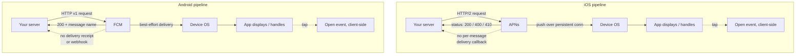

You ship a feature that depends on push notifications, and then the questions start. A user says the alert never showed up. Product asks what your delivery rate is. Someone wants a dashboard that says how many notifications were "delivered" versus "opened." You go looking for those numbers and discover that the two platforms you send to, Apple's and Google's, answer the question very differently, and one of them barely answers it at all.

This is the detail that trips up most push implementations: "delivered" is not a single, portable concept. On iOS it means one thing and you get a decent signal for it. On Android it means something you largely cannot observe. If you build a metric that treats both the same, the metric lies, and it lies in the direction that makes Android look worse or better than reality depending on how you fudged it.

This piece is the push-specific companion to the broader look at notification delivery guarantees. Here we stay inside the push pipeline: what actually happens between your server and a device, exactly what APNs and FCM each tell you, how to define sent, delivered, and opened so the definitions survive contact with reality, and how to build the best tracking the platforms allow.

## The push pipeline, end to end

A push notification is not a direct connection from your server to a phone. It is a relay through a gateway that each platform owns, and understanding the hops is what makes the confirmation gaps obvious.

The path is the same shape on both platforms:

1. Your server builds a payload and sends it to the platform gateway (APNs for Apple, FCM for Google), authenticated with a token or key, and addressed to a device token.
2. The gateway validates the request and accepts or rejects it, returning a status to your server.
3. The gateway attempts to deliver to the device over its own persistent connection, storing and forwarding if the device is briefly offline.
4. The device's operating system receives the payload and either displays it or hands it to your app.
5. If the user taps it, your app can record that interaction.

Your server has direct visibility into step 2 only. Steps 3 and 4 happen inside the gateway and the device, on infrastructure you cannot see. Step 5 you can instrument yourself, on the client. Every claim about "delivery" lives or dies on how much the gateway tells you about step 3, and that is exactly where the two platforms diverge.



Both platforms leave the server blind after acceptance. The difference is in the quality of that acceptance and the error detail that comes with it.

## APNs signal versus FCM silence

### What APNs tells you

When you send to APNs over its HTTP/2 API, you get a synchronous response with a status code and, on failure, a specific reason. The useful ones:

- **`200`.** APNs accepted the notification for delivery. Paired in the response with an `apns-id` you can log and correlate.
- **`400`.** Bad request, with a reason string like `BadDeviceToken` or `PayloadTooLarge`. This is a fix-your-request signal, not a retry signal.
- **`403`.** An authentication problem with your token or certificate.
- **`410`.** The device token is no longer valid, with a `timestamp` for when it went inactive. This is the one to act on: delete the token so you stop sending to a dead endpoint.

APNs also honors an `apns-expiration` header (store and forward until this time, then give up) and collapses notifications sharing an `apns-collapse-id`. What none of this gives you is a callback that fires when the phone displays the notification. APNs acceptance means "APNs has taken responsibility and will attempt delivery," which is a genuinely useful, specific acceptance, but it is still acceptance, not a delivery receipt.

### What FCM does not tell you

FCM's HTTP v1 API returns a `200` with a message name (like `projects/your-project/messages/0:1234567890`) when it accepts your message. Error responses are reasonably specific too: `UNREGISTERED` for a stale token (Android's analog to APNs `410`), `INVALID_ARGUMENT` for a malformed payload, `QUOTA_EXCEEDED` for rate limits.

But acceptance is where the real-time signal ends. FCM does not provide delivery receipts. There are no delivery webhooks. Nothing calls back to your server when the message reaches the device or when the OS displays it. Google's own documentation states that FCM delivery is best-effort and that a successful API response does not guarantee the device received the message. This is not an oversight in your integration. It is the documented behavior of the platform.

There is one partial escape hatch, and it is worth knowing precisely for what it is. FCM offers a BigQuery data export that logs message events, including aggregate delivery data for certain message types. It is delayed (batched into BigQuery, not real-time) and aggregate-oriented, so it can tell you roughly how many messages were delivered over a period. It cannot give you a live, per-message "this notification arrived" event you can branch on inside a workflow. A govtech team that wants to correlate a specific message ID with its delivery outcome can join that message name against the BigQuery export after the fact, which is real and useful for audits, but it is forensics, not real-time tracking.

So the blunt summary, and the line worth remembering when you design around it: FCM will tell you it accepted your message. It will never tell you the phone got it.

## Sent, delivered, opened, defined precisely

Because the platforms report different things, your metric definitions have to be explicit or your dashboard becomes fiction. Define each state by the observable event that backs it, not by a hopeful label.

- **Sent.** Your server received a success response from the gateway (APNs `200` or FCM `200`). This is fully observable on both platforms and means "accepted by the gateway." It does not mean the device has it. Both platforms support this cleanly.
- **Delivered.** The message reached the device OS. On iOS you cannot directly observe this in real time either, though APNs acceptance is a stronger proxy and its error codes prune failures well. On Android you cannot observe it per message in real time at all. Be honest that "delivered" for push is, at best, an inference, and on FCM it is an aggregate estimate from a delayed export.
- **Opened.** The user interacted with the notification (tapped it, or your app registered it as seen). This is the one delivery-adjacent state you can measure directly, because it happens in your app on the device, where your code runs.

The practical consequence: "sent" and "opened" are honest, portable metrics. "Delivered" is a soft metric that means different things per platform, and you should either annotate it heavily or avoid presenting it as if it were a hard number. A health platform frustrated that Firebase messaging gives no delivery signal is not misconfigured. It is running into the platform's actual limit, and the right response is to stop treating "delivered" as a reliable Android metric and lean on "opened" plus in-app state instead.

## Correlating message IDs and instrumenting opens

Since the gateways will not push delivery events to you, the tracking you can build rests on two things you do control: the message IDs the gateways hand back, and the client-side events your app can emit.

**Correlate on the gateway message ID.** Log the `apns-id` (iOS) and the FCM message name (Android) at send time, keyed to your own internal notification ID. This is what lets you later join an individual notification against APNs error responses, an FCM `UNREGISTERED` cleanup, or the FCM BigQuery export. Without that correlation stored at send time, after-the-fact reconciliation is impossible.

**Instrument opens on the client.** The device is the one place you can observe what actually happened to the notification, so put your best tracking there. Include your internal notification ID in the payload, and report back when the app handles or the user taps the notification.

```ts
// Client-side (React Native example). Report the open back to your server,
// carrying the same notification ID you logged at send time.
messaging().onNotificationOpenedApp((remoteMessage) => {
  const notificationId = remoteMessage.data?.notificationId;
  if (!notificationId) return;

  fetch("https://api.yourapp.com/notifications/opened", {
    method: "POST",
    headers: { "Content-Type": "application/json" },
    body: JSON.stringify({
      notificationId,
      platform: Platform.OS, // "ios" | "android"
      openedAt: new Date().toISOString(),
    }),
  });
});
```

On iOS you can go a little further: a Notification Service Extension runs when a notification with `mutable-content` arrives, before the user interacts, which gives you a closer-to-delivery client signal than Android exposes. It is not free (it runs on the device under a tight time budget and only for notifications configured for it), but for high-value alerts it is the nearest thing to a real iOS delivery event.

The pattern that falls out of this: you cannot measure delivery from the server, so you measure engagement from the client and treat that as your ground truth for "the notification reached a human."

## Designing around the gaps

Once you accept what the platforms do and do not report, the architecture almost writes itself. Three principles cover it.

**Treat push as best-effort, always.** Never make push the sole path for anything that must reach the user, because you have no per-message confirmation on Android and only a strong proxy on iOS. Push is for immediacy and reach, not for guarantees. If a message truly must land, push is one of several attempts, not the whole plan.

**Make the in-app Inbox your source of truth.** The one channel where you can confirm the message exists and know whether it was read is the in-app feed, because the record lives in a system you own. Write every important notification there in addition to firing push. When the user opens the app, they read a record you wrote, and you know for certain it was delivered and whether it was seen. Push may have arrived; the Inbox record definitely did.

**Clean up dead tokens on the signals you do get.** Both platforms tell you when a token is dead (APNs `410`, FCM `UNREGISTERED`). Consume those, delete the tokens, and your "sent" numbers stop being polluted by endpoints that were never going to receive anything. This is the one place the gateways give you unambiguous truth, so use it.

Put together, the honest push stack looks like this: send to APNs and FCM for reach, log both gateway message IDs, prune dead tokens on the error signals, instrument opens on the client as your real engagement metric, and back everything with an in-app Inbox that actually confirms. That is the most tracking the platforms allow, and it is enough to run on, as long as you never mistake FCM's `200` for a phone that buzzed.

## Where Novu fits

Novu is the delivery layer that puts APNs and FCM behind one workflow, so you send once and Novu handles the per-platform payloads, token cleanup on `410` and `UNREGISTERED`, and message-ID logging for correlation. It records each step in an activity feed and pairs push with an in-app Inbox that gives you the confirmation the gateways cannot. Novu does not invent a delivery receipt FCM refuses to send. It gives you the real signals, cleanly unified, plus the one channel that actually confirms.

If you are wiring up push tracking and want to stop hand-rolling two platform integrations, see how the [Novu docs](https://docs.novu.co) model push alongside the in-app Inbox and the activity feed. Track what you can observe, treat the rest as best-effort, and be precise in your own dashboard about which is which.
