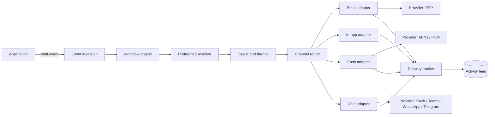
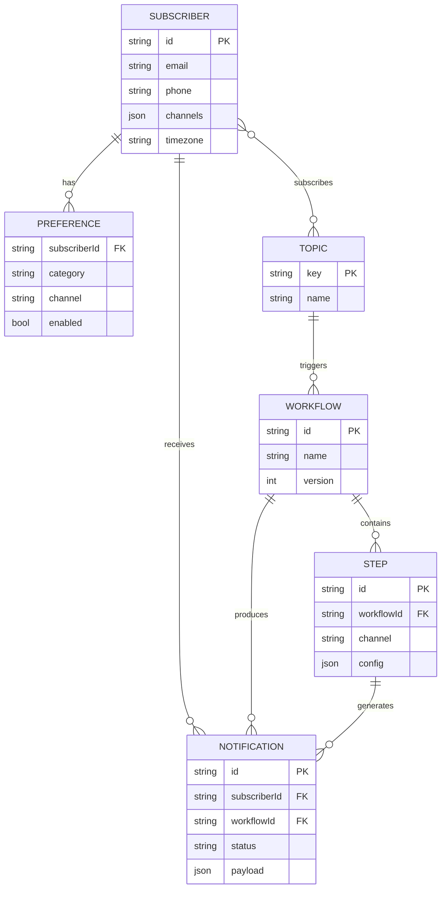
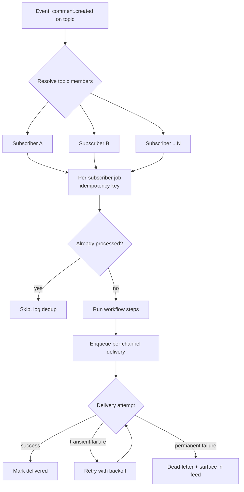

Almost every product needs to tell users things. A password was reset, a build failed, an invoice is overdue, someone mentioned you in a comment. The first version is always a send function. Someone writes `sendEmail(user, message)`, ships it, and moves on. It works, and for a while nobody thinks about it again.

Then the requirements arrive. Add push. Add an in-app inbox. Let users mute the noisy stuff. Do not send a thousand emails when a batch job touches a thousand rows. Tell me why a message did not go out. Each request seems small. Together they turn that send function into a distributed system with delivery guarantees, and most teams do not notice the transition until they are debugging it in production.

This is a guide to the shape of that system: the components, the data model, the delivery semantics, and the tradeoffs that actually bite. It is vendor-credible but not a pitch. The product shows up once, at the end, because the architecture is the point. Keep one idea in the back of your mind the whole way through, because everything below is a variation on it: a notification system is not a send function. It is a routing decision, a preference check, and a delivery guarantee wearing a trench coat.

## The requirements that make notifications hard

Before drawing boxes, get honest about what makes this problem non-trivial. If you only ever send one email per event to every user, you do not need any of this. The difficulty comes from the combination of the following requirements, all of which tend to arrive.

- **Multi-channel.** The same event reaches users across email, in-app inbox, push, Slack, Microsoft Teams, WhatsApp, and Telegram. Each has a different payload shape, delivery model, and failure mode. Email is fire-and-hope with async bounces. Push has device tokens that expire. Chat channels have their own rate limits and formatting.
- **Preferences.** Users want control at the intersection of category and channel. Security alerts by email, social activity in-app only, nothing on weekends. The preference model is a matrix, not a boolean, and it has to be checked on every send without becoming a bottleneck.
- **Deduplication.** The same logical event can be produced more than once (a retried job, an at-least-once queue, two services reacting to the same state change). Users should not get the same alert twice. That means an idempotency story from ingestion all the way to delivery.
- **Digest and throttling.** High-frequency events must collapse. Ten comments in five minutes becomes one "10 new comments" notification. A user should never be flooded. This is inherently stateful and time-windowed.
- **Scale.** Fan-out is multiplicative. One event to a topic with 50,000 subscribers across three channels is 150,000 deliveries, each with its own retry curve. Traffic is spiky, tied to product events and business hours.
- **Observability.** When someone asks "did the alert go out, and if not, why", you need a per-user, per-message, cross-channel answer. Without it, every notification bug is an archaeology project.

Hold these six in mind. Every component below exists to serve one or more of them.

## The core components, end to end

Here is the decomposition that a maturing notification system converges on, whether the team plans it or discovers it. The names vary. The responsibilities do not.



Walk it left to right.

### Event ingestion

The front door. Your application emits an event, not a message: "invoice.overdue", with a payload of `invoiceId`, `amount`, `subscriberId`. The distinction is load-bearing. The application says what happened. It does not decide who gets told, on which channel, or whether to tell them at all. That separation is what keeps notification logic out of your business code.

Ingestion accepts the event, validates it, assigns it a stable id for idempotency, and hands it to the engine. This is also where you enforce back-pressure. A spike in events should queue, not topple the downstream stages.

### Workflow engine

The brain of the routing decision, and the component people most often under-build. A workflow is the versioned definition of what happens when an event fires: which channels, in what order, with what delays, gated by which conditions. "On invoice.overdue: send email immediately, wait three days, if still unpaid send a second email and an in-app notice."

Keeping this as a first-class, versioned definition (rather than branching `if` statements scattered across services) is the single highest-leverage architectural choice in the whole system. It is the difference between changing behavior by editing one definition and changing it by hunting through call sites.

### Preference resolver

Before any channel fires, this stage answers "is this user willing to receive this category on this channel right now". It reads the preference matrix, applies quiet-hours and timezone rules, and filters the channel list for this specific delivery. Critical-path, so it has to be fast, which usually means the preference store is cached aggressively with careful invalidation.

### Digest and throttle

The stateful stage. It buffers events over a window keyed by user and digest rule, and either releases them individually or collapses them into one summary. This is where "10 new comments" is born. It needs durable timers and a store that survives restarts, because a digest that loses its buffer on deploy silently drops notifications.

### Channel router and provider adapters

The router takes the surviving channel list and dispatches to an adapter per channel. Each adapter translates the canonical message into that channel's specific shape and speaks to the underlying provider: an ESP such as SendGrid or Resend for email, APNs or FCM for push, the platform APIs for Slack, Microsoft Teams, WhatsApp, and Telegram. The adapter owns provider-specific retries, rate limiting, and error mapping. Isolating this means a provider outage or migration touches one adapter, not the whole pipeline.

### Delivery tracker and activity feed

Every attempt, success, failure, bounce, open, and click flows into the tracker, which writes a per-user, per-message, cross-channel timeline. This is what turns "I think it sent" into "delivered to email at 14:03, opened at 14:07, in-app read at 14:10". It is both your debugging surface and, often, the data behind a user-facing in-app inbox.

## The data model

The components above only make sense on top of a small set of durable entities. Get these right and the rest follows.



Four entities carry the weight.

- **Subscriber.** The recipient, decoupled from your user table. It holds channel identifiers (email, phone, device tokens, chat handles) and a timezone. Keeping subscribers separate from your internal user records means the notification system does not need to understand your domain, only who to reach and how.
- **Topic.** A named group for fan-out. Instead of enumerating recipients, you publish to a topic ("project-42-watchers") and the system resolves membership at send time. This is what makes broadcast to 50,000 subscribers a single trigger.
- **Workflow and Step.** The versioned routing logic, described above, made durable. A workflow has ordered steps, each bound to a channel with its own config.
- **Preference.** The per-subscriber, per-category, per-channel matrix. Modeled as rows rather than a JSON blob so it can be queried and aggregated, though hot reads are almost always cached.

A design note worth stating plainly: separate the subscriber from your user. Teams that jam notification state into their existing users table regret it the first time they need a second product surface, a service account, or an external recipient who is not a user at all.

## Fan-out and delivery: at-least-once and idempotency

This is where the trench coat comes off and you are looking at a distributed system. Fan-out is the moment one event becomes many deliveries, and the delivery guarantee you choose shapes everything downstream.

The honest default is **at-least-once**. Exactly-once delivery across independent external providers is not achievable in the general case (you cannot atomically both send an email and record that you sent it), so you commit to at-least-once and then make duplicates harmless through idempotency. The alternative, at-most-once, means silently dropping notifications on failure, which is rarely acceptable for the security-alert and billing-notice traffic that matters most.



A few decisions make this robust in practice.

**Idempotency keys everywhere.** Derive a stable key per logical delivery, for example `hash(eventId + subscriberId + stepId)`. Before running a step, check whether that key has been processed. This is what lets you retry aggressively and reprocess a queue without double-sending. It is the single most important reliability mechanism in the system.

**Fan-out as individual jobs.** Resolve topic membership into one durable job per subscriber, do not process a 50,000-member topic in one transaction. Per-subscriber jobs isolate failures (one bad recipient does not sink the batch), parallelize cleanly, and retry independently.

**Retries with backoff, then a dead-letter queue.** Transient provider errors (a 429, a timeout) retry with exponential backoff and jitter. Permanent errors (invalid address, unsubscribed) fail fast, land in a dead-letter queue, and surface in the activity feed rather than retrying forever.

**Queue-backed, not in-request.** None of this happens in the request that emitted the event. Ingestion enqueues, the request returns, and workers drain the pipeline. Your API latency stays flat while a broadcast to tens of thousands processes in the background.

The tradeoff to name out loud: at-least-once plus idempotency is more moving parts than a naive synchronous send, and you will occasionally serve a duplicate if an idempotency check races. In exchange you get a system that does not lose notifications under load or during deploys, which is the correct trade for anything a user relies on.

## Preferences, digest, and throttle in the pipeline

These three are worth a closer look because they are where notification systems earn their keep, and where naive implementations quietly break.

**Preferences as a pipeline stage, not a caller responsibility.** The wrong pattern is checking preferences at each call site before triggering. It scatters the logic and guarantees drift. The right pattern is a resolver stage that every notification passes through, reading the matrix once and filtering channels. A subscriber who muted "social" on email but kept it in-app gets exactly one of the two channels, decided in one place. Because it is on the critical path, the preference store is read-through cached, with invalidation on preference writes.

**Digest as a windowed buffer.** A digest step holds events in a durable buffer keyed by (subscriber, digest rule) for a configured window, a fixed five minutes, or a smarter "wait until quiet" backoff. When the window closes, buffered events collapse into one notification with an aggregated payload. The two failure modes to design against: losing the buffer on restart (use durable storage and timers, not in-memory state) and unbounded windows (cap the buffer and the wait).

```ts
// A workflow expressed as ordered steps. Preference and digest
// are stages in the pipeline, not checks in your app code.
const commentWorkflow = workflow("new-comment", async ({ step, payload }) => {
  // Collapse bursts: buffer for 5 minutes, then send one summary.
  const digest = await step.digest("collect", {
    amount: 5,
    unit: "minutes",
  });

  await step.inApp("inbox", () => ({
    body: `You have ${digest.events.length} new comments`,
  }));

  // Preference and quiet-hours filtering happen in the resolver
  // stage before this email is dispatched to the ESP.
  await step.email("notify", () => ({
    subject: `${digest.events.length} new comments`,
    body: renderDigest(digest.events),
  }));
});
```

**Throttle as a rate guard.** Distinct from digest. Throttle caps how many notifications of a type a user can receive per window, dropping or deferring the excess. Where digest merges, throttle limits. Both protect the user from flooding, and both belong in the pipeline rather than in the code that emits events.

## Observability and the activity feed

You cannot operate what you cannot see, and notifications are especially prone to silent failure because the feedback loop runs through external providers and human inboxes. Build the observability in from the start.

Two layers matter.

**System observability** is the operator's view: delivery rates per channel and provider, queue depth and lag, retry and dead-letter volume, per-provider error rates. This is standard metrics-and-tracing work, but the dimensions are notification-specific. A rising email bounce rate or a Slack adapter throwing 429s should page someone before users notice.

**The activity feed** is the per-subscriber timeline: every notification this user was sent, on which channel, with which status, and when it was opened or read. This does double duty. It is the answer to "why did this user not get the alert" (you can see it was suppressed by a preference, or dead-lettered on a bad address), and it is frequently the backing store for a user-facing in-app inbox. Because you are already tracking every delivery for reliability, exposing a filtered slice of it as an inbox is a small additional step, not a separate system.

The design principle: the delivery tracker is not a logging afterthought bolted on at the end. It is a first-class component that every adapter writes to, because the record of what happened is as much a product feature as the sending itself.

## Where a platform saves you

Here is the honest build-versus-buy bridge, because you can build everything above, and for some teams that is the right call.

Build it yourself when notifications are core to your product's differentiation, when you have unusual requirements no general system models well, or when you have the team to own a stateful distributed system for the long haul. It is a real, well-understood engineering project. None of the components above are mysterious.

The reason most teams should not is that the hard parts are not the parts that make your product better. Nobody chooses your product because you hand-rolled idempotent fan-out or a durable digest buffer. That work is necessary, invisible when it works, and painful when it does not. The list is long: the workflow engine, the preference matrix with caching and invalidation, durable digest windows, per-provider adapters and their retry curves, the delivery tracker, and the operational burden of keeping all of it running under spiky load. Mature teams, in construction tech, API security, and AI infrastructure among them, converge on exactly this architecture, and a good share of them decide the undifferentiated core is worth adopting rather than rebuilding.

That is the case for notification infrastructure as a component you integrate rather than a system you own. You keep the parts that are specific to your product (which events fire, what the messages say, how the workflows branch) and delegate the parts that are the same for everyone (fan-out, delivery guarantees, preferences, digest, tracking).

Novu is this architecture as open-source infrastructure, roughly 40K stars on GitHub, available as cloud or self-hosted. The workflow engine, subscriber and preference model, multi-channel routing, digest and throttle steps, and the activity feed are the components in this guide, built and maintained so you integrate them instead of rebuilding them. The [architecture and workflow docs](https://docs.novu.co) map directly onto the sections above if you want to see how the pieces line up in practice.
