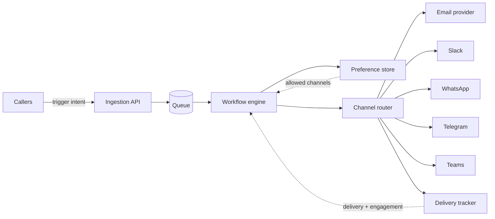
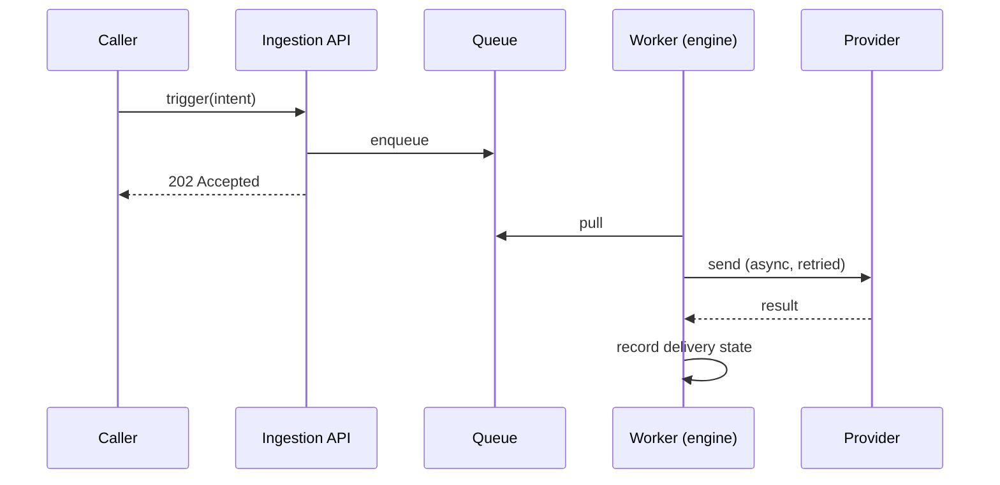

Most notification code does not start as a service. It starts as a function. Someone needs to send a welcome email, so they drop a call to SendGrid into the signup handler. A quarter later, someone else needs a payment-failed alert, so they write a second call in the billing service, with its own retry logic and its own idea of what a template is. A quarter after that, a third team wires up a Slack alert for security events, and now you have three implementations of "send a message to a human" that agree on nothing: not retries, not rate limiting, not user preferences, not how you tell whether a message actually landed.

That is the moment the notification microservice earns its keep. Not before. This guide covers what that service is made of, where its boundary sits, the interface callers talk to, and the honest signal for when extracting it is worth the cost. The build reality is the part most teams underestimate: a real notification service, one with a template engine, multi-channel routing, preferences, delivery tracking, and retries, is roughly a six-to-twelve-month effort for a three-person team. That number is why most teams extract the service once and then quietly question whether they should own the engine inside it.

## Signs your notifications should be their own service

The trigger is duplication, not volume. You can send millions of emails a day from a single well-placed function and never need a service. You can send a few thousand and need one badly. The question is how many places in your codebase know how to send.

Watch for these:

- Three teams each reinventing "send an email" in three slightly different, slightly broken ways. One retries, one does not. One respects a user's unsubscribe flag, two forget it exists.
- Preference logic copy-pasted. When a user says "no more marketing emails," you have to remember every send site that might violate it. Miss one and you have a compliance problem, not a bug.
- No single answer to "did this notification get delivered?" Delivery state lives in whatever logs each service happens to write, so debugging a "I never got the email" ticket means grepping three codebases.
- Every new channel is a project. Adding Slack means touching every service that wants to post to Slack, because there is no shared place for a channel to live.
- Provider credentials sprayed across services. Your SendGrid key is in four `.env` files, and rotating it is a cross-team coordination exercise.

None of these is fatal on its own. Together they mean the cost of not having a service now exceeds the cost of building one. Here is the takeaway to hold onto: extract notifications when three teams are each reinventing "send an email" in three slightly different, slightly broken ways. Duplication of a broken thing is the signal, because it means the domain is real and the pain is spreading.

## The service boundary and interface

A notification service has one job: turn an intent to notify someone into a delivered message, correctly, once, on the right channel, respecting that person's preferences. Everything the service owns follows from that sentence. Everything a caller has to know should be as small as possible.

The interface is the contract, and the discipline is keeping it thin. A caller should hand over an intent and nothing operational. It should not pass a rendered email body. It should not pass a channel. It should not know your provider exists.

A good trigger call looks like this:

```ts
await notifications.trigger({
  // WHAT happened. Maps to a workflow the service owns.
  workflow: "payment-failed",

  // WHO to reach. Your user ID, not an email or phone number.
  recipient: { subscriberId: "user_8f3a" },

  // The data the templates need. No formatting, no channel logic.
  payload: {
    amountCents: 4200,
    currency: "USD",
    invoiceUrl: "https://app.example.com/i/inv_221",
    retryDate: "2026-08-01",
  },
});
```

Look at what the caller does not supply. No subject line. No "send this on email, and also Slack if they are on the Pro plan." No channel fan-out. No knowledge of whether the user has muted payment alerts. The billing service knows a payment failed and who it belongs to. That is all it should know. The workflow named `payment-failed`, owned by the notification service, decides the rest: which channels, in what order, with which templates, subject to which preferences.

This is what makes the service worth extracting rather than just refactoring. The boundary moves a whole category of decisions out of every product team and into one place that is good at them.

## The internal components

Behind that thin interface sits a small set of components, each with a clear responsibility. You can draw the whole thing on one diagram.



**Ingestion.** The front door. It accepts trigger calls, validates them against a known workflow, resolves or upserts the recipient, and puts the work on a queue. Ingestion does as little as possible synchronously. It says "accepted" and hands off. Keeping this layer thin is what lets you absorb a spike from a batch job without falling over.

**The workflow engine.** The core, and the expensive part to build well. It runs the logic attached to a workflow: send on these channels, in this order, wait this long between steps, skip the SMS if the in-app Inbox message was already seen, batch these ten events into one digest. It renders templates against the payload. It handles the branching. This is where the six-to-twelve months mostly goes, because "wait two hours, then send email only if still unread" is easy to describe and hard to make reliable across restarts, retries, and millions of concurrent flows.

**The channel router.** Given a rendered message and a target channel, it talks to the right provider and normalizes the result. Email goes to your email provider. Slack, Microsoft Teams, WhatsApp, and Telegram each have their own transport and their own failure modes. The router hides those differences from the engine and turns provider-specific responses into one internal shape: accepted, soft-failed (retry), hard-failed (do not retry). In-app Inbox and push are handled here too, as channels the router knows how to write to.

**The delivery tracker.** The component that answers "what happened to this notification?" It records state transitions (queued, sent, delivered, opened, failed) and feeds engagement back to the engine, so a workflow can make a real decision like "they read it in the Inbox, do not also send the email." Without a tracker you have a fire-and-forget system, and fire-and-forget is exactly the thing your three duplicated implementations already do badly.

**The preference store.** The single source of truth for what each recipient has agreed to receive, per channel and per category. The engine consults it before every send. This is the component that, once centralized, quietly deletes a whole class of compliance bugs, because there is now exactly one place that can honor an unsubscribe and exactly one place to audit.

## Sync at the edge, async underneath

The trigger call should return in milliseconds. Delivery should not happen inside it. The moment you make a caller wait for an email provider to accept a message, you have coupled your signup latency to a third party's p99, and you have made a provider outage into an outage of your own product.

So the interface is queue-backed. Ingestion validates and enqueues, then returns. Workers pull from the queue and run the workflow. The queue is not a detail, it is the thing that gives you the properties you actually want:

- **Backpressure.** A million-row batch job floods the queue, not your database or your provider. Workers drain it at a sustainable rate.
- **Retries with control.** A soft failure goes back on the queue with a backoff. The caller never sees it.
- **Isolation.** A slow WhatsApp send does not block a fast Inbox write, if you shard queues by channel or priority.
- **Survivability.** A worker crash mid-workflow does not lose the intent. It is still on the queue, or checkpointed, and another worker resumes it.

Kafka, SQS, Redis streams, or a database-backed queue all work. The choice matters less than the discipline: the synchronous surface is validation and enqueue, and everything with a provider on the other side of it runs async.



## Multi-tenant concerns

If your product is itself multi-tenant, your notification service inherits that, and a few things stop being optional.

**Isolation of sending reputation.** One tenant's spammy behavior should not tank email deliverability for everyone. That can mean per-tenant subdomains, per-tenant provider subaccounts, or at least per-tenant rate limits and monitoring, so a bad actor is contained.

**Data partitioning.** Recipients, preferences, and delivery history are tenant-scoped. A query must never cross tenants, and your preference lookups should carry the tenant in the key, not rely on application code to remember.

**Per-tenant configuration.** Tenants often need their own branding, their own from-address, sometimes their own provider credentials (bring-your-own-SendGrid). The workflow engine has to resolve config in tenant context at send time, which is another reason the engine is the hard part.

**Fair scheduling.** A single tenant firing a ten-million-recipient campaign should not starve every other tenant's transactional email. Priority lanes, per-tenant quotas, and separate queues for transactional versus bulk are how you keep a password reset moving while a marketing blast drains in the background.

None of this is exotic, but all of it is work, and it is work that compounds the six-to-twelve-month estimate. It is also work you should not do twice, which is the whole argument for the service.

## Build the engine, or adopt one

Here is the fork in the road, stated plainly. Extracting the service is almost always right once you hit the duplication signal. The boundary is yours, the interface is yours, the fact that product teams send an intent and nothing else is yours. That part you own no matter what.

The engine inside the service is the expensive, undifferentiated part. The template rendering, the multi-channel routing, the step-and-wait workflow logic, the delivery tracking, the retry semantics, the preference enforcement: this is the six-to-twelve-months, and it is roughly identical across every company that builds it. Mature teams in construction tech, AI infrastructure, and collaboration platforms all run notifications as a dedicated internal service, and the ones who built the engine from scratch will tell you it was more service than they meant to own.

The pattern that ages well is to keep the boundary and adopt the engine. Your service still owns the interface product teams call. Behind it, an engine handles workflows, channels (Slack, Microsoft Teams, WhatsApp, Telegram, Email, plus in-app Inbox and push), templates, preferences, and delivery tracking, so your three-person team spends its year on the parts specific to your product instead of rebuilding step-and-wait logic that already exists.

Novu is built to be that engine. It gives you the workflow engine, multi-channel routing, a template layer, subscriber preferences, and delivery tracking behind an API, so the service you extract is a thin layer you own over an engine you do not have to maintain. If you are staring at three copies of "send an email" and a year of work to unify them, that is the trade worth weighing. See the [Novu docs](https://docs.novu.co) for the workflow and API model.
