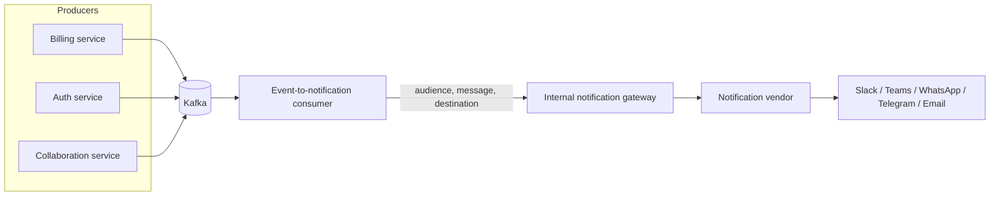

There is a tell that separates teams who have run notifications at scale from teams who are about to learn. Ask a product engineer at the first kind of team which notification vendor the company uses. They will not know. They send an intent to an internal service, and something they never look at decides the rest. That ignorance is not a gap. It is the design working.

This is the internal platform pattern for notifications: a thin service your product teams call, sitting in front of whatever vendor actually delivers the message. Product teams send three things, an audience, a message, and a destination, and never learn the vendor's SDK, its rate limits, its template syntax, or its name. This guide covers why you would wrap a vendor at all, what the internal interface looks like, how you translate your existing events into it, where preferences and templates live, and the payoff that makes the whole thing worth it: the vendor stays swappable. Which, counterintuitively, is a compliment to a good vendor, not an insult.

## Why wrap a vendor at all

The instinct to push back here is healthy. You picked a good notification vendor precisely so you would not have to build this. Why add a layer in front of it?

Because a raw vendor SDK, called directly from twenty places, recreates every problem the vendor was supposed to solve, just one level up:

- **The vendor's vocabulary leaks into your product code.** Its concept of a "campaign" or "message type" or "audience list" ends up hard-coded in your billing service, your auth service, your onboarding flow. Now the vendor's model is your model, everywhere.
- **Cross-cutting rules have no home.** Quiet hours, per-user notification caps, a global kill switch for a bad deploy, category-level unsubscribe. With direct calls, each rule has to be re-implemented at every call site, or it does not exist.
- **You cannot see your own notification traffic.** There is no single place to log, meter, or rate-limit what your product sends, because there is no single place it goes through.
- **Swapping or adding a vendor is a company-wide migration.** Because the vendor's API is your API, changing it touches every team.

A thin internal service fixes all four by giving you one place that owns the vendor relationship. Product teams talk to you. You talk to the vendor. The best notification integration is the one your product teams never see: they send an intent, and the platform decides everything else.

## The internal interface: audience, message, destination

The whole pattern rests on getting the interface right, and the interface is deliberately small. A caller provides three things:

- **Audience.** Who should receive this, expressed in your identifiers. A user ID. A team ID. A topic like `project:221:watchers`. Never an email address or a phone number, because those are contact details the platform resolves, not the caller.
- **Message.** What happened and the data to render it, not the rendered text. An event name plus a typed payload. The caller says "an invoice failed, here is the amount and the retry date." It does not say "Subject: Your payment failed."
- **Destination.** Intent about reach, not mechanism. Often this is nothing at all, and the platform decides from the message type and the recipient's preferences. When a caller does express it, it is coarse: "this is transactional, it must reach them" versus "this is a digest item, batch it."

```ts
// What a product team writes. Nothing here names the vendor.
await platform.notify({
  audience: { userId: "user_8f3a" },
  message: {
    event: "invoice.payment_failed",
    data: { amountCents: 4200, currency: "USD", retryDate: "2026-08-01" },
  },
  // destination is optional; the platform resolves channels + preferences
});
```

Everything a vendor SDK would demand, the API key, the channel, the template ID, the provider-specific payload shape, is absent. That absence is the product. The caller expresses intent. The platform owns mechanism.

## Translating your events

Most teams do not want product code calling even the internal API by hand for every notification. The higher-leverage move is to translate events you already emit. If your services publish domain events to Kafka (or any bus), you can bridge those into notifications without product teams writing a single notify call.

The bridge is a small consumer sitting between your event bus and an internal HTTP gateway. It subscribes to the domain events that should produce notifications, maps each one to the platform's audience-message-destination shape, and calls the gateway. The gateway is the thin service that owns the vendor.



The consumer holds the mapping ("`invoice.payment_failed` becomes a notification to the account owner"), which keeps that policy out of the billing service. The gateway holds the vendor relationship. An AI-infrastructure team running this exact shape translates Kafka events through a gateway so their product services stay entirely event-driven and entirely unaware that a notification vendor is downstream. The producers just emit facts. The bridge turns facts into notifications.

You do not need a bus to use the pattern. A synchronous service calling the gateway's HTTP endpoint directly works fine. The event bridge is simply the version that scales to many producers without any of them learning the platform.

## Where preferences and templates live

Two questions decide how clean this stays: where do user preferences live, and where do templates live. Get these wrong and the vendor leaks back through.

**Preferences belong to the platform.** The platform is the one place that sees every send, so it is the only place that can enforce "no notifications between 10pm and 8am in the user's timezone," "no more than five of these a day," or "this user unsubscribed from digest emails." Product teams must not carry preference logic, because any team that forgets is a compliance incident. Centralizing preferences is most of the reason the platform earns its existence.

**Templates often belong to the product teams, through the platform.** This is the nuance that trips people up. The rendered wording of a payment-failure message is domain knowledge the billing team owns. The mechanism for rendering and delivering it is platform knowledge. The pattern that scales is to let each product team own its templates as versioned artifacts (in their own repo, reviewed by them), and register them with the platform, while the platform owns rendering, channel selection, and delivery. The billing team writes the words. The platform decides it goes to Email and Slack, respects preferences, and tracks whether it landed.

The line is: content is domain, delivery is platform. Preferences are always platform, because they cut across every domain.

## Keeping the vendor swappable

Here is the payoff, and it is worth being precise about what it does and does not mean. Because product teams only ever touched audience-message-destination, and never the vendor's SDK, replacing the vendor is a change inside the gateway alone. You reimplement one adapter. Nothing upstream moves. No product team is involved. A migration that would have been a quarter-long cross-team project becomes a task on the platform team's board.

Being able to swap the vendor is not a plan to swap the vendor. Most teams who build this never switch, and that is fine. Swappability is a compliment to a good vendor, not a threat to it: it means you chose the vendor on its merits and can keep choosing it every quarter, rather than being locked in and quietly resentful. It also means you can run two vendors at once (one for email, one for chat channels), or route a fraction of traffic to a new one to evaluate it, all behind the same internal interface. Optionality is the real prize. The swap is just the proof the optionality is real.

## What you should not abstract

The failure mode of this pattern is over-abstraction, and it is worth naming so you avoid it. Not everything the vendor does should be hidden.

- **Do not abstract away channel-specific richness that your product actually uses.** A Slack message with interactive buttons, a WhatsApp template with its approval requirements, an in-app Inbox item with an action: if your product relies on the shape, force-fitting it into a lowest-common-denominator "message" throws away the reason you chose those channels. Let the platform expose channel-specific options where they matter, rather than pretending every channel is a string.
- **Do not build a generic "any vendor, any feature" abstraction up front.** Wrap the one vendor you have, for the features you use. A speculative abstraction over vendors you might someday adopt is cost with no payoff, and it usually models the wrong things.
- **Do not hide delivery status and failures.** Product teams sometimes genuinely need to know a notification bounced or a channel is down. The platform should surface delivery and engagement state through its own API, not swallow it in the name of simplicity.
- **Do not reinvent the vendor's engine inside the gateway.** The gateway is a thin adapter and a policy layer. If you find yourself building template rendering, retry orchestration, and multi-channel workflow logic inside it, you have stopped wrapping the vendor and started rebuilding it, which is the opposite of the goal.

The gateway is thin on purpose. It owns the interface, preferences, and the vendor relationship. It does not own the delivery engine.

## Where this lands

The pattern is stable across every team that runs it. A construction-tech company whose internal consumers are completely oblivious to which vendor delivers their messages. An API-security company whose notification service receives an audience, a message, and a destination, and nothing more. An AI-infrastructure company translating Kafka events through a gateway so producers stay unaware. Different domains, same shape: a thin internal service, a small intent-based interface, preferences centralized, the vendor swappable and therefore chosen freely.

Novu is designed to sit behind exactly this kind of service. Its `subscriberId` is your user ID, so audience maps straight through with no contact details in your product code. Topics cover the "everyone watching this project" audience without you maintaining recipient lists. The API takes an event and a payload, which is your message, and the platform resolves channels, preferences, templates, and delivery tracking behind it. It is, in other words, the vendor you can put behind a gateway and then stop thinking about. See the [Novu docs](https://docs.novu.co) to map your interface onto it.
