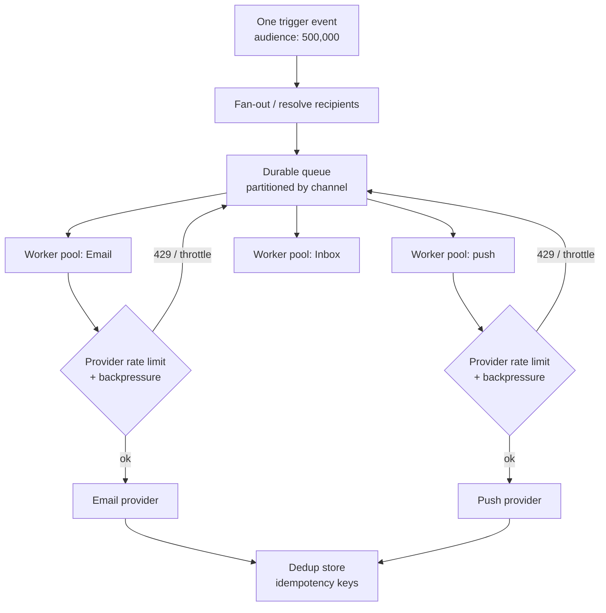

A homegrown notification system works beautifully in the demo and on a Tuesday afternoon. It falls over the first time real load arrives, and real load never arrives politely. It arrives as one event that has to reach a very large number of people in a very short window. A marketing campaign fires. An incident opens and every subscriber to a service needs to know. A scheduled job wakes up and a million reminders come due at once.

The interesting engineering is not in sending a notification. It is in sending 500,000 of them in a few minutes without dropping any and without sending some twice, while every downstream provider you depend on is actively trying to slow you down. This is the part that a naive implementation gets wrong, and it gets wrong in a specific, predictable order.

## The spike, illustrated

Picture a consumer app with a large user base. Someone clicks send on an announcement targeted at 500,000 users. In the ideal world every one of them gets it within a few minutes, so the throughput you need is on the order of a few thousand messages per second, sustained, across a mix of Email, push, and in-app Inbox.

That number alone is not scary. Plenty of systems push a few thousand operations a second. What makes notifications hard is everything wrapped around that number:

- The work is **spiky**, not steady. You are idle, then you need full throughput now, then you are idle again. You cannot provision for the average.
- Each recipient may resolve to **several channel deliveries**, each with its own provider, its own rate limit, and its own failure modes.
- Providers are **third parties you do not control**. They will throttle you, return transient errors, and occasionally accept a message and then lose it.
- The blast radius of a bug is the whole audience. Send twice and 500,000 people notice at once.

To see why the naive version breaks, start with what it does: a loop.

```ts
// The version that works in the demo and pages you at 2am.
for (const user of recipients) {
  await emailProvider.send(user.email, renderedMessage);
}
```

At 500,000 recipients this is a single synchronous loop bottlenecked on one provider connection. It runs for hours, holds one process hostage, and has no story for what happens when it dies at recipient 300,000. Restart it and the first 300,000 people get the message again. Every problem below is a problem this loop cannot solve.

## Fan-out: turn one event into many units of work

The first move is to stop thinking about one big send and start thinking about many small, independent, retryable units of work. One trigger event fans out into one job per recipient per channel, and those jobs run across a pool of workers pulling from a queue.



Three ideas do the heavy lifting here.

**Topics for the fan-out itself.** You do not want the triggering service to enumerate 500,000 recipients in-process. You want it to publish one event against a topic (a project, a segment, a broadcast audience) and let the notification layer expand the membership into individual jobs. The producer stays cheap and fast. The expensive fan-out happens where it can be parallelized and retried.

**Worker pools, partitioned by channel.** Email, push, and Inbox have different throughput ceilings and different providers. Give each its own pool and its own queue partition so a slow Email provider does not stall push delivery. Within a pool you scale workers horizontally to hit your target rate, and because each job is independent, a worker dying takes one job down, not the batch.

**Batching where the provider rewards it.** Many providers accept batch or multicast calls. Grouping a few hundred recipients into one API call cuts overhead dramatically. Batch on the write to the provider, but keep per-recipient accounting so one bad address in a batch does not fail the other 299.

The shape to internalize: producers publish events, a durable queue absorbs the spike, worker pools drain it at a controlled rate. The queue is what converts an instantaneous spike into sustained, survivable throughput.

## Backpressure and provider rate limits

Here is the part homegrown systems almost always skip. Your worker pool can generate load far faster than any provider will accept it. Email providers, push gateways, and messaging APIs all publish rate limits, and they enforce them with `429 Too Many Requests` and, when you really lean on them, by dropping your connection. The provider is not the place to be optimistic.

Backpressure means the system slows itself down on purpose so it never generates more work than the slowest stage can absorb. Without it, the sequence is grimly predictable: workers fire as fast as they can, the provider returns 429s, naive code treats a 429 as a failure and retries immediately, the retries add load, and you have built a feedback loop that guarantees the provider stays angry. This is a self-inflicted denial of service.

Doing it right has three parts:

- **Throttle to the provider's published limit, not your capacity.** A limiter in front of each provider pool (token bucket, leaky bucket) caps outbound rate at or just under what the provider allows. Your workers can be idle waiting on the limiter. That is the system working, not failing.
- **Respect the signals the provider sends.** A `429` often carries a `Retry-After`. Honor it. Back off exponentially with jitter so a fleet of workers does not resynchronize into a thundering herd on the next attempt.
- **Let the queue hold the backlog.** When the provider is the bottleneck, work piles up in the durable queue, which is exactly what it is for. Depth rises, then drains. A spike becomes a slightly longer delivery window instead of a pile of dropped messages.

The mental model: the provider sets the pace, and your job is to match it without fighting it.

## At-least-once and dedup: exactly-once is a myth

Now the hard theoretical corner, the one with real operational teeth. You want each recipient to get each notification exactly once. You cannot have that. Distributed exactly-once delivery across systems you do not control is not achievable, because the failure that matters is unobservable from your side.

Walk the sequence. A worker calls the provider. The provider accepts and sends. On the way back, the acknowledgment is lost to a timeout. From where the worker sits, "sent, ack lost" and "never sent" are byte-for-byte identical. You have exactly two options, and both are wrong in one direction:

- Assume it failed and retry: risk sending twice.
- Assume it succeeded and move on: risk sending zero times.

For notifications, silently dropping a message is usually the worse outcome, so the sane default is **at-least-once delivery**: when in doubt, retry. That guarantees no one is silently skipped, and it guarantees you will sometimes attempt to send the same thing twice. Retries are not a bug in this design. They are the design.

Which is exactly why at-least-once is only half an architecture. The other half is **deduplication**, and it is what turns "at least once" into "effectively once" from the recipient's point of view. Every unit of work carries a stable **idempotency key** derived from its identity, for example a hash of `(eventId, subscriberId, channel, stepId)`. Before a worker sends, it checks a dedup store for that key. First time through, it claims the key and sends. On a retry, the key is already there and the send is skipped.

```ts
async function deliver(job: DeliveryJob) {
  // Deterministic across every retry of the same logical send.
  const idempotencyKey = hash(
    job.eventId,
    job.subscriberId,
    job.channel,
    job.stepId,
  );

  // Atomic claim. Returns false if this key was already handled.
  const claimed = await dedupStore.claim(idempotencyKey, { ttl: '72h' });
  if (!claimed) {
    return; // Already delivered (or in flight). Do not send again.
  }

  try {
    await provider.send(job);
  } catch (err) {
    if (isRetryable(err)) {
      await dedupStore.release(idempotencyKey); // let a later retry try again
    }
    throw err;
  }
}
```

The subtle bits are the ones that decide whether this actually holds up. The claim has to be **atomic**, a compare-and-set, so two workers racing the same job cannot both win. The key needs a **TTL** long enough to outlive your entire retry window, because a dedup entry that expires before the last retry lets a duplicate through. And you have to decide, deliberately, whether a failed send releases the key for another attempt or burns it. The pattern above releases on retryable errors and holds otherwise. Get these three right and at-least-once plus dedup gives you the practical exactly-once that recipients actually experience.

## Throttle to protect downstream systems

Rate limiting is not only about keeping providers happy. It is also about protecting yourself and your users. A 500,000-recipient blast frequently includes a link back to your own application. Every recipient who taps that link arrives within the same few-minute window. Your notification system just became a load generator pointed at your own API.

So throttling runs in two directions. Outbound, you pace to the provider. Inbound to your own infrastructure, you deliberately spread delivery so the click-through wave does not arrive as a wall. Stretching a broadcast over a longer window, or dripping it in controlled waves, keeps the notification from taking down the thing it is advertising. This is also where user-facing throttling lives: collapsing ten rapid-fire events into one digest so a busy account does not get ten separate pings. Same lever, two beneficiaries.

## What breaks a homegrown system first

Build this in-house and the failures arrive in a consistent order.

1. **The synchronous loop, first.** The `for` loop that sends inline is the first thing to fall over. It cannot parallelize, it cannot survive a restart without redelivering, and it turns a few-minute job into a multi-hour one. Replacing it with a queue and worker pool is the first thing everyone does, usually right after the first incident.
2. **Missing dedup, right behind it.** Once retries exist, and they must, duplicate sends appear. Without idempotency keys and an atomic dedup store, at-least-once delivery means users get the same message two, three, five times. This is the bug that generates support tickets and erodes trust fastest.
3. **No backpressure, in the first real spike.** The system that never hit a provider limit in testing slams into `429`s in production, retries them blindly, and amplifies its own load. Adding limiters and honoring `Retry-After` is the third lesson.
4. **State and observability, eventually.** At volume you need to answer "did this specific user get this specific notification," and a system built as fire-and-forget cannot. Per-recipient status, retries, and dead-letter handling get retrofitted, painfully.

None of these are exotic. They are the standard tax on moving from "sends a notification" to "runs a notification service," and the ordering almost never varies.

The scale here is not hypothetical. A consumer-fintech app can project into the hundreds of millions of notifications over a campaign season. An infrastructure vendor can run on the order of a million notifications a day with roughly 300,000 concentrated in a three-hour window. Those are recipient-side realities, not a single system's steady state, and every one of them lives or dies on the four fixes above. At a 500,000 fan-out, the question is not can you send. It is can you not send twice, and can you survive the provider telling you to slow down.

Novu treats fan-out, throttling, retries, and idempotency as infrastructure so you are not rebuilding this queue-and-dedup machinery per project. It is the delivery layer: it moves the messages, paces them to your providers, and keeps per-recipient state, and it is open source (around 40K GitHub stars). The [Novu documentation](https://docs.novu.co) covers topics, workflow steps, and idempotency in depth.
